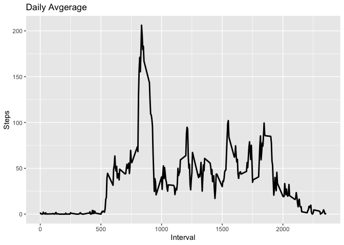
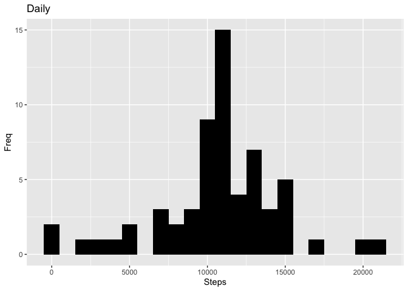
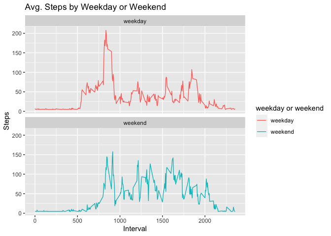

##Reproducible Research Project 1 Assignment

### Background

It is now possible to collect a large amount of data about personal movement using activity monitoring devices such as a Fitbit, Nike Fuelband, or Jawbone Up. These type of devices are part of the “quantified self” movement – a group of enthusiasts who take measurements about themselves regularly to improve their health, to find patterns in their behavior, or because they are tech geeks. But these data remain under-utilized both because the raw data are hard to obtain and there is a lack of statistical methods and software for processing and interpreting the data.

This assignment makes use of data from a personal activity monitoring device. This device collects data at 5 minute intervals through out the day. The data consists of two months of data from an anonymous individual collected during the months of October and November, 2012 and include the number of steps taken in 5 minute intervals each day.

The data for this assignment can be downloaded from the course web site:

Dataset: [Activity monitoring data](https://d396qusza40orc.cloudfront.net/repdata%2Fdata%2Factivity.zip) [52K]  

The variables included in this dataset are:

- steps: Number of steps taking in a 5-minute interval (missing values are coded as NA)
- date: The date on which the measurement was taken in YYYY-MM-DD format
- interval: Identifier for the 5-minute interval in which measurement was taken

The dataset is stored in a comma-separated-value (CSV) file and there are a total of 17,568 observations in this dataset.

NOTE: The GitHub repository also contains the dataset for the assignment so you do not have to download the data separately.

###Set Environment


```r
#setwd("~/Documents/GitHub/5_ReproducibleResearch/ReproducibleResearch_PeerAssessment1")
library(tidyverse, lib.loc = "/Library/Frameworks/R.framework/Versions/4.0/Resources/library")
```

```
## ── Attaching packages ─────────────────────────────────────── tidyverse 1.3.0 ──
```

```
## ✓ ggplot2 3.3.3     ✓ purrr   0.3.4
## ✓ tibble  3.0.6     ✓ dplyr   1.0.4
## ✓ tidyr   1.1.2     ✓ stringr 1.4.0
## ✓ readr   1.4.0     ✓ forcats 0.5.1
```

```
## ── Conflicts ────────────────────────────────────────── tidyverse_conflicts() ──
## x dplyr::filter() masks stats::filter()
## x dplyr::lag()    masks stats::lag()
```

```r
library("data.table")
```

```
## 
## Attaching package: 'data.table'
```

```
## The following objects are masked from 'package:dplyr':
## 
##     between, first, last
```

```
## The following object is masked from 'package:purrr':
## 
##     transpose
```

```r
library("knitr")
knitr::opts_chunk$set(echo = TRUE)
knitr::opts_chunk$set(error = FALSE)
knitr::opts_chunk$set(warning = FALSE)
library(data.table)
setwd("~")
```

###Loading and pre-processing the data

- Load the data (i.e. read.csv)  

```r
download.file("https://d396qusza40orc.cloudfront.net/repdata%2Fdata%2Factivity.zip", destfile = 'activity.zip', method = "curl")
unzip("activity.zip")
Activity <- data.table::fread(input = "activity.csv")
```
- Process/transform the data into a format suitable for your analysis

```r
Activity[, date := as.POSIXct(date, format = "%Y-%m-%d")]
```

###What is mean total number of steps taken per day (ignoring the missing values in the dataset)?

- Calculate the total number of steps taken per day

```r
Steps <- Activity[, c(lapply(.SD, sum, na.rm = FALSE)), .SDcols = c("steps"), by = .(date)] 
```
- Following is a histogram of the total number of steps taken each day

```r
ggplot(Steps, aes(x = steps)) + geom_histogram(fill = "black", binwidth = 1000) + labs(title = "Daily", x = "Steps", y = "Freq")
```

<!-- -->
- Calculate and report the mean and median of the total number of steps taken per day

```r
Steps[, .(Avg = mean(steps, na.rm = TRUE), Med = median(steps, na.rm = TRUE))]
```

```
##         Avg   Med
## 1: 10766.19 10765
```

###What is the average daily activity pattern?  
- Time series of the 5-min interval (x-axis) and the avg num of steps taken, avg across all days (y-axis)

```r
Interval <- Activity[, c(lapply(.SD, mean, na.rm = TRUE)), .SDcols = c("steps"), by = .(interval)] 
ggplot(Interval, aes(x = interval , y = steps)) + geom_line(color="black", size=1) + labs(title = "Daily Avgerage", x = "Interval", y = "Steps")
```

<!-- -->
- Which 5-minute interval, on average across all the days in the dataset, contains the max number of steps?

```r
Interval[steps == max(steps), .(max_interval = interval)]
```

```
##    max_interval
## 1:          835
```

##Imputing missing values   
Note that there are a number of days/intervals where there are missing values (coded as NA). The presence of missing days may introduce bias into some calculations or summaries of the data.

- Calculate and report total num of missing values in the dataset (i.e. total number of rows with NAs)

```r
Activity[is.na(steps), .N ]
```

```
## [1] 2304
```
- The strategy for filling in all of the missing values in the dataset is to use the mean value.

```r
ActivityImputed <- Activity
ActivityImputed[is.na(steps), "steps"] <- Activity[, c(lapply(.SD, mean, na.rm = TRUE)), .SDcols = c("steps")]
```
- Create a new dataset that is equal to the original dataset but with the missing data filled in.

```r
data.table::fwrite(x = ActivityImputed, file = "ActivityImputed.csv", quote = FALSE)
```

- Histogram of the total number of steps taken each day with imputed dataset.

```r
StepsImputed <- ActivityImputed[, c(lapply(.SD, sum)), .SDcols = c("steps"), by = .(date)] 
ggplot(StepsImputed, aes(x = steps)) + geom_histogram(fill = "black", binwidth = 1000) + labs(title = "Daily", x = "Steps", y = "Freq")
```

<!-- -->
Calculate and report the mean and median total number of steps taken per day. Do these values differ from the estimates from the first part of the assignment? What is the impact of imputing missing data on the estimates of the total daily number of steps?

```r
Steps[, .(Avg = mean(steps, na.rm = TRUE), Med = median(steps, na.rm = TRUE))]
```

```
##         Avg   Med
## 1: 10766.19 10765
```

```r
StepsImputed[, .(Avg = mean(steps, na.rm = TRUE), Med = median(steps, na.rm = TRUE))]
```

```
##         Avg   Med
## 1: 10751.74 10656
```
###Differences in activity patterns between weekdays and weekends?  
- Create a new factor variable in the dataset with two levels – “weekday” and “weekend”

```r
Activity[, `DoW`:= weekdays(x = date)]
Activity[grepl(pattern = "Monday|Tuesday|Wednesday|Thursday|Friday", x = `DoW`), "weekday or weekend"] <- "weekday"
Activity[grepl(pattern = "Saturday|Sunday", x = `DoW`), "weekday or weekend"] <- "weekend"
Activity[, `weekday or weekend` := as.factor(`weekday or weekend`)]
```

###Panel plot comparing Weekday to Weekend activity.

```r
Activity[is.na(steps), "steps"] <- Activity[, c(lapply(.SD, mean, na.rm = TRUE)), .SDcols = c("steps")]
Interval <- Activity[, c(lapply(.SD, mean, na.rm = TRUE)), .SDcols = c("steps"), by = .(interval, `weekday or weekend`)] 
ggplot(Interval , aes(x = interval , y = steps, color=`weekday or weekend`)) + geom_line() + labs(title = "Avg. Steps by Weekday or Weekend", x = "Interval", y = "Steps") + facet_wrap(~`weekday or weekend` , ncol = 1, nrow=2)
```

<!-- -->


