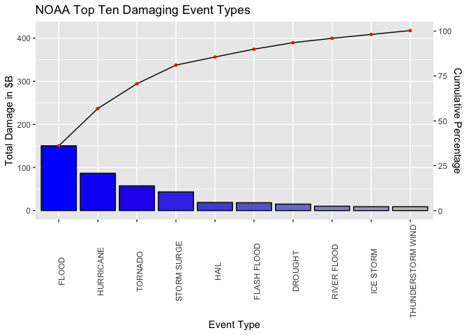
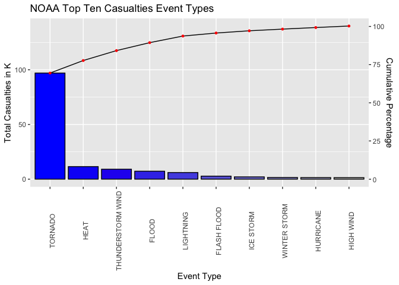

## Analyzing NOAA Storm Data for Casualties and Damage

## Synopsis (Abstract)
This project explores the NOAA Storm Database and answers questions about severe weather events and the ipact on fatalities, injuries, and property damage. Using the database at the link below, code contained in this document describes the process and results for the analysis.

## Assignment Background
Storms and other severe weather events can cause both public health and economic problems for communities and municipalities. Many severe events can result in fatalities, injuries, and property damage, and preventing such outcomes to the extent possible is a key concern.

This project involves exploring the U.S. National Oceanic and Atmospheric Administration's (NOAA) storm database. This database tracks characteristics of major storms and weather events in the United States, including when and where they occur, as well as estimates of any fatalities, injuries, and property damage.

### Data
The data for this assignment come in the form of a comma-separated-value file compressed via the bzip2 algorithm to reduce its size. You can download the file from the course web site:

- [Storm Data](https://d396qusza40orc.cloudfront.net/repdata%2Fdata%2FStormData.csv.bz2) [47Mb]  

There is also some documentation of the database available. Here you will find how some of the variables are constructed/defined.

- National Weather Service [Storm Data Documentation](https://d396qusza40orc.cloudfront.net/repdata%2Fpeer2_doc%2Fpd01016005curr.pdf)
- National Climatic Data Center Storm Events [FAQ](https://d396qusza40orc.cloudfront.net/repdata%2Fpeer2_doc%2FNCDC%20Storm%20Events-FAQ%20Page.pdf)

The events in the database start in the year 1950 and end in November 2011. In the earlier years of the database there are generally fewer events recorded, most likely due to a lack of good records. More recent years should be considered more complete.

## Data Processing
### Setup
The analysis was conducted using:  
- R Studio Version 1.3.1073  
- MacBookPro 16" 2019 running macOS Big Sur 11.2

### Set the R Studio environment

```r
setwd("~/Documents/GitHub/5_ReproducibleResearch/ReproducibleResearch_PeerAssessment2")
library(tidyverse, lib.loc = "/Library/Frameworks/R.framework/Versions/4.0/Resources/library")
```

```
## ── Attaching packages ─────────────────────────────────────── tidyverse 1.3.0 ──
```

```
## ✓ ggplot2 3.3.3     ✓ purrr   0.3.4
## ✓ tibble  3.0.6     ✓ dplyr   1.0.4
## ✓ tidyr   1.1.2     ✓ stringr 1.4.0
## ✓ readr   1.4.0     ✓ forcats 0.5.1
```

```
## ── Conflicts ────────────────────────────────────────── tidyverse_conflicts() ──
## x dplyr::filter() masks stats::filter()
## x dplyr::lag()    masks stats::lag()
```

```r
library("data.table")
```

```
## 
## Attaching package: 'data.table'
```

```
## The following objects are masked from 'package:dplyr':
## 
##     between, first, last
```

```
## The following object is masked from 'package:purrr':
## 
##     transpose
```

```r
library("knitr")
library("ggQC")
knitr::opts_chunk$set(echo = TRUE)
knitr::opts_chunk$set(error = FALSE)
knitr::opts_chunk$set(warning = FALSE)
options(timeout=6000) #more time for big file and slow internet
```

### Import the Data
Download the Storm Data zipped .csv from the link above, unzip and assign to data.table Storm 
 

```r
if (!file.exists("repdata%2Fdata%2FStormData.csv.bz2")) {  
    download.file("https://d396qusza40orc.cloudfront.net/repdata%2Fdata%2FStormData.csv.bz2", 
        destfile="repdata%2Fdata%2FStormData.csv.bz2")  
}  
StormDFrame <- read.csv("repdata%2Fdata%2FStormData.csv.bz2")  
Storm <- as.data.table(StormDFrame)  ##Create the data.table Storm
```
### What It Looks Like

```r
head(Storm, n=3L)
```

```
##    STATE__          BGN_DATE BGN_TIME TIME_ZONE COUNTY COUNTYNAME STATE  EVTYPE
## 1:       1 4/18/1950 0:00:00     0130       CST     97     MOBILE    AL TORNADO
## 2:       1 4/18/1950 0:00:00     0145       CST      3    BALDWIN    AL TORNADO
## 3:       1 2/20/1951 0:00:00     1600       CST     57    FAYETTE    AL TORNADO
##    BGN_RANGE BGN_AZI BGN_LOCATI END_DATE END_TIME COUNTY_END COUNTYENDN
## 1:         0                                               0         NA
## 2:         0                                               0         NA
## 3:         0                                               0         NA
##    END_RANGE END_AZI END_LOCATI LENGTH WIDTH F MAG FATALITIES INJURIES PROPDMG
## 1:         0                      14.0   100 3   0          0       15    25.0
## 2:         0                       2.0   150 2   0          0        0     2.5
## 3:         0                       0.1   123 2   0          0        2    25.0
##    PROPDMGEXP CROPDMG CROPDMGEXP WFO STATEOFFIC ZONENAMES LATITUDE LONGITUDE
## 1:          K       0                                         3040      8812
## 2:          K       0                                         3042      8755
## 3:          K       0                                         3340      8742
##    LATITUDE_E LONGITUDE_ REMARKS REFNUM
## 1:       3051       8806              1
## 2:          0          0              2
## 3:          0          0              3
```
### Clean the Data
That's 37 variables in *Storm* and we only need 7 for our analysis, therefore subset for just those 7.  Also, over 2/3's of the observations report no Casualties or Damage so those get filtered out too.

Now, what does the subset look like?

```r
Storm <- select(Storm, EVTYPE, FATALITIES, INJURIES, PROPDMG, PROPDMGEXP, CROPDMG, CROPDMGEXP) #Select just the needed factors
Storm <- filter(Storm, !(FATALITIES==0 & INJURIES==0 & PROPDMG==0 & CROPDMG==0)) #Filter out observations with no casualties or damage reported
head(Storm, n=3L)
```

```
##     EVTYPE FATALITIES INJURIES PROPDMG PROPDMGEXP CROPDMG CROPDMGEXP
## 1: TORNADO          0       15    25.0          K       0           
## 2: TORNADO          0        0     2.5          K       0           
## 3: TORNADO          0        2    25.0          K       0
```

A note on the exponent columns labeled "PROPDMGEXP" and "CROPDMGEXP".  The documentation from NOAA was not explicit on their use, but logically it appears as if they are various character values that are meant to reflect multipliers to the base "PROPDMG" and CROPDMG" factors.  Some assumptions were made in the making of a translation table but are shown below for full reproducibility.

```
##    Exponent Multiplier
## 1         K       1000
## 2         k       1000
## 3         M    1000000
## 4         m    1000000
## 5         B 1000000000
## 6         b 1000000000
## 7         H        100
## 8         h        100
## 9         0          1
## 10        1         10
## 11        2        100
## 12        3       1000
## 13        4      10000
## 14        5     100000
## 15        6    1000000
## 16        7   10000000
## 17        8  100000000
## 18        9 1000000000
## 19        +          1
## 20        -          1
## 21        ?          1
## 22                   1
```
Next replace PROPDMGEXP and CROPDMGEXP with data useable for calculations from the Exponent lookup table just created


```r
Storm$PROPDMGEXP <- factor(Storm$PROPDMGEXP, levels=Exponent$Exponent, labels=Exponent$Multiplier) #Replace exponents with numbers from lookup
Storm$CROPDMGEXP <- factor(Storm$CROPDMGEXP, levels=Exponent$Exponent, labels=Exponent$Multiplier) #Same for Crop Damage
Storm <- transform(Storm, PROPDMGEXP = as.numeric(as.character(PROPDMGEXP))) #Convert the exponents from character to numeric
Storm <- transform(Storm, CROPDMGEXP = as.numeric(as.character(CROPDMGEXP))) #Same for Crop
```
Now the Casualty and Damage Factors are cleaned up, create two new calculated factors called CASUALTY and DAMAGE.  CASUALTY will simply add FATALITIES and INJURIES together for each observation.  If one were so inclined, a weighting factor like 5x could be added to FATALITIES but both will be weighted 1x here.  DAMAGE will simple multiply each damage factor by its respective exponent multiplier and then sum Property and Crop damage for each observation.


```r
Storm <- mutate(Storm, DAMAGE=(PROPDMG*PROPDMGEXP)+(CROPDMG*CROPDMGEXP)) #Sum the damage for each observation
Storm <- mutate(Storm, CASUALTIES=FATALITIES+INJURIES) #Sum the casualties for each observation
#Now the Damage and Casualties have been summed for each observation, get rid of the unnecessary factors
Storm <- select(Storm, EVTYPE, CASUALTIES, DAMAGE)
```

The data is now clean and ready for analysis, but the observations still have a mess in the Event Type *EVTYPE* and needs cleanup.  A quick look at uniques for *EVTYPE* show almost 500 and looking through the list there are several entered using the wrong case, typos, initial spaces, invalid types.  Look at the summary below to appreciated the magnitude of the issue.

```r
UniqueEVTYPE <- distinct(Storm, EVTYPE,.keep_all = FALSE)
summary(UniqueEVTYPE)
```

```
##     EVTYPE         
##  Length:488        
##  Class :character  
##  Mode  :character
```

The questions we will be dealing with per *EVTYPE* are looking for maximums so we need not cleanup every *EVTYPE* just those that are contenders for most CASUALTIES or DAMAGE.  First, get all *EVTYPE*s into upper case.

```r
Storm <- Storm[ , EVTYPE := toupper(EVTYPE)] #Convert all EVTYPE to upper case
Storm$EVTYPE <- trimws(Storm$EVTYPE, which = c("left")) #Clean up leading white space
UniqueEVTYPE <- distinct(Storm, EVTYPE,.keep_all = FALSE) #Count the uniques now
summary(UniqueEVTYPE)
```

```
##     EVTYPE         
##  Length:444        
##  Class :character  
##  Mode  :character
```
A little Pareto analysis shows that the top contenders in EVTYPE dominate their respective groups so we need only correct EVTYPE for the top ten to ensure EVTYPE is normalized.  The following tables show this.

```r
DamageGrouped <- Storm %>% group_by(EVTYPE) %>%  summarize(TOTAL_DAMAGE=sum(DAMAGE))
CasualtiesGrouped <- Storm %>% group_by(EVTYPE) %>%  summarize(TOTAL_CASUALTIES=sum(CASUALTIES))
DamageGrouped <- arrange(DamageGrouped, desc(TOTAL_DAMAGE))
CasualtiesGrouped <- arrange(CasualtiesGrouped, desc(TOTAL_CASUALTIES))
head(DamageGrouped, n=10L)
```

```
## # A tibble: 10 x 2
##    EVTYPE             TOTAL_DAMAGE
##    <chr>                     <dbl>
##  1 FLOOD             150319678257 
##  2 HURRICANE/TYPHOON  71913712800 
##  3 TORNADO            57362333946.
##  4 STORM SURGE        43323541000 
##  5 HAIL               18761221986.
##  6 FLASH FLOOD        18244041078.
##  7 DROUGHT            15018672000 
##  8 HURRICANE          14610229010 
##  9 RIVER FLOOD        10148404500 
## 10 ICE STORM           8967041360
```

```r
head(CasualtiesGrouped, n=10L)
```

```
## # A tibble: 10 x 2
##    EVTYPE            TOTAL_CASUALTIES
##    <chr>                        <dbl>
##  1 TORNADO                      96979
##  2 EXCESSIVE HEAT                8428
##  3 TSTM WIND                     7461
##  4 FLOOD                         7259
##  5 LIGHTNING                     6046
##  6 HEAT                          3037
##  7 FLASH FLOOD                   2755
##  8 ICE STORM                     2064
##  9 THUNDERSTORM WIND             1621
## 10 WINTER STORM                  1527
```
The entire EVTYPES is a mess still, but our Pareto Analysis has show that a few categories dominate both DAMAGE and CASUALTIES, therefore just corrections for a few incorrect codings for the top ten EVTYPE follow. A lot more could be done here if further analysis were to be done.


```r
Storm$EVTYPE[Storm$EVTYPE=="HURRICANE/TYPHOON"] <- "HURRICANE"
Storm$EVTYPE[Storm$EVTYPE=="TSTM WIND"] <- "THUNDERSTORM WIND"
Storm$EVTYPE[Storm$EVTYPE=="EXCESSIVE HEAT"] <- "HEAT"
# Regroup everything with the updated coding to prepare for the final graphics prints.  Same code as done prior to support the Pareto Analysis.
DamageGrouped <- Storm %>% group_by(EVTYPE) %>%  summarize(TOTAL_DAMAGE=sum(DAMAGE))
CasualtiesGrouped <- Storm %>% group_by(EVTYPE) %>%  summarize(TOTAL_CASUALTIES=sum(CASUALTIES))
DamageGrouped <- arrange(DamageGrouped, desc(TOTAL_DAMAGE))
CasualtiesGrouped <- arrange(CasualtiesGrouped, desc(TOTAL_CASUALTIES))
head(DamageGrouped, n=10L)
```

```
## # A tibble: 10 x 2
##    EVTYPE             TOTAL_DAMAGE
##    <chr>                     <dbl>
##  1 FLOOD             150319678257 
##  2 HURRICANE          86523941810 
##  3 TORNADO            57362333946.
##  4 STORM SURGE        43323541000 
##  5 HAIL               18761221986.
##  6 FLASH FLOOD        18244041078.
##  7 DROUGHT            15018672000 
##  8 RIVER FLOOD        10148404500 
##  9 ICE STORM           8967041360 
## 10 THUNDERSTORM WIND   8945031367
```

```r
head(CasualtiesGrouped, n=10L)
```

```
## # A tibble: 10 x 2
##    EVTYPE            TOTAL_CASUALTIES
##    <chr>                        <dbl>
##  1 TORNADO                      96979
##  2 HEAT                         11465
##  3 THUNDERSTORM WIND             9082
##  4 FLOOD                         7259
##  5 LIGHTNING                     6046
##  6 FLASH FLOOD                   2755
##  7 ICE STORM                     2064
##  8 WINTER STORM                  1527
##  9 HURRICANE                     1446
## 10 HIGH WIND                     1385
```

## Results
Create Top Ten Lists for Damage and Casualties

```r
TopDamage <- slice(DamageGrouped, 1:10) # Pick the top ten damages
TopCasualties <- slice(CasualtiesGrouped, 1:10) # Pick the top ten casualties
```

### Render Damage Pareto

```r
TopDamage$EVTYPE <- factor(TopDamage$EVTYPE, levels = TopDamage$EVTYPE) #Tell ggplot not to reorder x-axis
DamagePareto <- ggplot(TopDamage, aes(x=EVTYPE, y=TOTAL_DAMAGE/1000000000)) +
    theme(axis.text.x = element_text(angle = 90)) +
    stat_pareto(point.color = "red",
             point.size = 1,
             line.color = "black",
             #size.line = 1,
             bars.fill = c("blue", "gray"),) +
    xlab("Event Type") +
    ylab("Total Damage in $B") +
    ggtitle("NOAA Top Ten Damaging Event Types")

DamagePareto
```

<!-- -->


### Render Casualties Pareto

```r
TopCasualties$EVTYPE <- factor(TopCasualties$EVTYPE, levels = TopCasualties$EVTYPE) #Tell ggplot not to reorder x-axis
CasualtiesPareto <- ggplot(TopCasualties, aes(x=EVTYPE, y=TOTAL_CASUALTIES/1000)) +
    theme(axis.text.x = element_text(angle = 90)) +
    stat_pareto(point.color = "red",
             point.size = 1,
             line.color = "black",
             #size.line = 1,
             bars.fill = c("blue", "gray"),) +
    xlab("Event Type") +
    ylab("Total Casualties in K") +
    ggtitle("NOAA Top Ten Casualties Event Types")

CasualtiesPareto
```

<!-- -->

## Assignment

### Question 1
Across the United States, which types of events (as indicated in the *EVTYPE* are most harmful with respect to population health?
- The 2nd Chart above shows Tornadoes to be the most hazardous.

### Question 2
Across the United States, which types of events have the greatest economic consequences?
- The 1st Chart above shows Flooding events to have the most econmic impact


